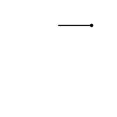
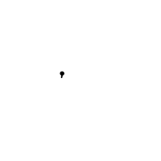
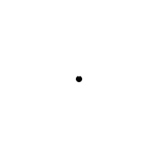
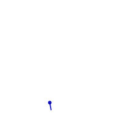

# Graft Generative Animation Language

## Try it out online via Mastodon

The easiest way to try crafting a generative animation is to toot a program
mentioning @graft@mastodon.social.  If you've never tooted before, see
[Mastodon.social](https://mastodon.social) to find out how to register.

## Install

To install Graft, clone this repository and make sure you have Python 3.6 or
above.

To display the animations in a window, install the Python bindings for
GTK3 and Cairo.

To create animated gifs, install the ImageMagick utilities too.

## Examples

To draw a circle:

```bash
./graft 'S() d+=10'   # Step forward, then turn 10 degrees
```


Thick, rough, red circles saved to a GIF:

```bash
# Set red to 100, set brush size to 10,
# turn a random amount, then turn 10 degrees, then step forward
./graft 'r=100 z=10 d+=R()+10 S()' --frames=100 --gif=cir.gif --width=100 --height=75
```


Spinning box:

```bash
./graft 's=100 J() d+=90 S() d+=90 S() d+=90 S() d+=90 d+=15'
```



Flock of tiddlers:

```bash
./graft 'F() d+=R()+10 S()'
```



Explosion:

```bash
./graft 'dd=0 ^ T(11,F) d=f*30 d+=dd T(10,S) dd+=1' --max-forks=100000 --frames=40
```



Windmill:

```bash
./graft --frames=20 'b=70 a=90 s=20 d-=10 T(10,{S() d+=4}) T(35,F) s=10 r=f g=f b=f r*=20 g*=45 b*=75 d=f*10 T(4,{S() d+=10}) T(6,{a-=20 S() d+=10}) ^ s=1 d+=10 S()'
```



There are more examples in the [animations](animations) directory.

## Commands

To turn, change the variable `d`:

* `d+=45` means turn 45 degrees clockwise.
* `d-=90` means turn 90 degrees anti-clockwise.
* `s=90` means set the angle to 90 degrees (face right).

To step forward (drawing a line), use the command `S()`:

* `S()` means step forward.  By default, this moves 10 units forward.

To change the step size, change the variable `s`:

* `s=20 S()` means change step size to 20, and step forward.
* `s/=2 S()` means halve the step size (divide by 2), and step forward.

To change the width of the lines, change the variable `z`:

* `z*=-1.5 S()` means multiply width by -1.5, and step forward.

To do something several times, call the `T` function, saying how many times
to do it, and giving the name of the function to call, or making a little
function right there:

* `T(2,S)` means step twice.
* `T(36,{d+=10 S()})` means turn then step 36 times.

By default, the whole of your program repeats over and over.  To repeat only
the last section (meaning the first section only runs once), add a label with
`^`:

* `s=1 ^ d+=10 s+=1 S()` means start with a step size of 1, and increase it
  (and the angle), then step, every time.  (Without the `^` the value of `s`
  would be reset back to 1 every time, because we'd start again at the
  beginning.)

## Special variables

Graft contains some variables with special meanings:

* `d` - "direction": the angle in degrees we are facing.
* `s` - "step size": how far the next `S()` call will move us.
* `z` - "size of brush": width of brush used for drawing lines.
* `r`, `g`, `b` - "red", "green", "blue": components of the colour of the
   brush (0-100).
* `a` - "alpha": transparency of the brush (0=transparent, 100=solid).
* `f` - "fork id": the number of the line we are currently controlling - this
  changes when we use `F()` to "fork" into multiple lines.

The colour and transparency values may be set to values outside the range.
Increasing or decreasing a value smoothly will result in gradual increase and
then decrease in the displayed value, because numbers over 100 wrap around to
-100, and negative values are displayed as their absolute value.

When graft starts, the following default values are set:

```graft
d=0
s=10
z=5
r=0
g=0
b=0
a=100
```

## Built-in functions

The following functions are pre-defined in graft:

* `S` - "Step": draw a line in direction `d` of length `s`.
* `D` - "Dot": draw a dot at x, y
* `L` - "Line to": draw a line from our old position to x, y
* `J` - "Jump": move `s` units in direction `d`, without drawing a line.
* `R` - "Random": return a random number between -10 and 10.
* `F` - "Fork": split into 2 lines, and continue running the same program
  in both.

## Language reference

Graft's syntax is a modified version of
[Cell](https://github.com/andybalaam/cell), and you can find out a lot more
about how Cell works on its web site.  The key modifications used in Graft are
that spaces are used to separate statements instead of semi-colons, and
variables can be modified.

### Numbers

Numbers are all held as floating point numbers.

They are written with an optional "-" followed by some digits, optionally
including a decimal point:

```
number ::= ["-"] digit* ["." digit*]
digit  ::= "0"..."9"
```

Note: because of Cell's "interesting" grouping rules, be careful when writing
"-" followed by an expression.  A leading "-" will negate the whole expression,
so "-3+4" will equal -7, not 1.  To force the order of evaluation, break your
expressions into multiple statements.

Note: when lines are actually drawn, all numbers are rounded to the nearest
0.1, but this does not affect variable values, just on-screen position.

### Symbols

Symbols are made up of lower and upper case ASCII characters:

```
symbol ::= (letter | "_")+
letter ::= "a"..."z" | "A"..."Z"
```

Note: by convention, symbols holding numbers are written in lower case, and
those holding functions are written in upper case.

### Changing variable values

To set a variable value, write the variable name, then "=", then the value.

```
assignment ::= symbol "=" input
input = number | functiondef | (symbol | functioncall)
```

To add, subtract, or divide by a number, write the variable name, then a modifying operator `+=`,
`-=`, `*=` or `/=`, then write the number.  Example:

* `d/=3.1` - divide `d` by 3.1.

To multiply, write a number next to the symbol:

* `d*=4.5` - multiply `d` by 4.5.

```
modify ::= symbol modify_operator input
modify_operator ::= "+=" | "-=" | "*=" | "/="
```

### Expressions

To calculate an something, write numbers or variables joined by an operator
like "+", "-", "*", or "/":

```
x=10*R()
```

```
expression ::= number | symbol | functioncall | modify | combination
combination ::= expression operator expression
operator :== "+" | "-" | "*" | "/"
```

### Running functions

To run a function, write its name, then "(", then the arguments separated by
commands, and then ")":

```
functioncall ::= symbol "(" [argument] ["," argument]* ")"
```

### Labels

To set the label (where in the program we will jump back to when we hit the
end), write "^":

```
label ::= "^"
```

### Combining statements

To run multiple statements, write them next to each other, separated by spaces
or new lines:

```
program ::= statement+
statement ::= statement_body [" " | "\n"]
statement_body ::= expression | label
```

### Defining functions

To describe a function, write "{", then the commands, then "}".  If the
function has arguments, write ":(" after the "{", then the arguments separated
by ",", then ")", and the commands after that.

The return value of the function is the value of the last statement inside it.

```
StepTurnStep={S() d+=10 S()}
```

```
Double={:(x) x*2}
```

```
Polygon={:(n, side) s=side T(n, {d+=360/n S()})}
```

```
functiondef ::= "{" program "}"
```

### Forking

If you want to draw two lines simultaneously, use the `F()` function.

For example, to split into 2 lines and then make each of them move randomly,
run:

```bash
./graft 'F() ^ d=R()*36 S()'
```

The above program means:

* `F()` - split into 2 lines
* `^` - set a label - when we reach the end we will restart here
* `d=R()*26` - set `d` to a random number between -360 and 360
* `S()` - draw a line in the direction (`d`) we are facing

To split into more lines, wrap the call to `F` with a `T`, meaning do it
several times.  For example:

```bash
./graft 'T(3,F) ^ d=R()*36 S()'
```

This program splits into 4 lines, and draws randomly as in the previous
example.

If you want to know which line is currently running, use the `f` variable.
The first line has `f` set to 0, and each time you fork the next line has
its version of `f` set to the next number: 1, 2 etc.

For example:

```bash
./graft 'T(17,F) d=f*20 ^ d+=10 S()'
```

The above program means:

* `T(17,F)` - split into 18 lines
* `d=f*20` - set `d` to 20 times the value of `f` - f is different for each
  line - 0, 1, 2, etc.)
* `S()` - draw a line in the direction (`d`) we are facing

Here's what it looks like:


## Command line arguments

```bash
$ ./graft --help
usage: graft [-h] [--frames NUMBER_OF_FRAMES] [--gif GIF_FILENAME]
             [--width WIDTH] [--height HEIGHT] [--max-forks MAX_FORKS]
             [--lookahead-steps LOOKAHEAD_STEPS] [--syntax {v1,cell}]
             program

positional arguments:
  program               The actual graft program to run, e.g. 'd+=10 S()' to
                        draw a circle.

optional arguments:
  -h, --help            show this help message and exit
  --frames NUMBER_OF_FRAMES
                        How many frames of the animation to draw, or -1 to
                        play forever.
  --gif GIF_FILENAME    Make an animated GIF instead of displaying on screen.
                        (Requires --frames=n where n > 0.)
  --width WIDTH         The width in pixels of the animation.
  --height HEIGHT       The height in pixels of the animation.
  --max-forks MAX_FORKS
                        The number of forked lines that can run in parallel.
  --lookahead-steps LOOKAHEAD_STEPS
                        How many steps to use to calculate the initial zoom
                        level.
  --syntax {v1,cell}    Choose which code style you want to use - v1 syntax
                        uses e.g. :R to call the R function, whereas cell
                        syntax uses the more familiar R(). For more info on
                        the v1 syntax, see SYNTAX_V1.md in the source
                        repository.
```

## Running the Mastodon bot

To run the bot yourself:

```bash
sudo apt install python3-pip
pip3 install Mastodon.py
```

```bash
$ ./bot-mastodon --help
usage: bot-mastodon [-h] [--register-app] [--user USER] [--password PASSWORD]
                    [--toot TOOT]

optional arguments:
  -h, --help           show this help message and exit
  --register-app       ONLY DO THIS ONCE - register this app with
                       mastodon.social. The client secret will be stored in
                       ~/.graftbot/mastodon/clientcred.secret
  --user USER          The username of the user on mastodon.social. You must
                       provide this and --password the first time you run. The
                       credentials will be stored in
                       ~/.graftbot/mastodon/usercred.secret
  --password PASSWORD  The password of the user on mastodon.social.
  --toot TOOT          Toot something!
```
