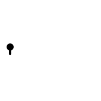
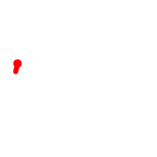

# Graft Generative Animation Language

## Examples

Circle:

```bash
./graft ':S+d'   # Step forward, then turn 10 degrees
```



Thick, rough, red circles:

```bash
# Set red to 100, set brush size to 10,
# turn a random amount, then turn 10 degrees, then step forward
./graft '100=r10=z:R~+d+d:S'
```



## Commands

To turn, change the variable `d`:

* `+d` means turn 10 degrees clockwise
* `45+d` means turn 45 degrees clockwise
* `90-d` means turn 90 degrees anti-clockwise
* `90=d` means set the angle to 90 degrees (face right)
* `-45=d` means set the angle to minus 45 degrees (face up-left)

To step forward (drawing a line), use the command `:S`:

* `:S` means step forward.  By default, this moves 10 units forward

To change the step size, change the variable `s`:

* `20=s:S` means change step size to 20, and step forward
* `2/s:S` means halve the step size (divide by 2), and step forward

To change the width of the lines, change the variable `z`:

* `1.5*z:S` means width by 1.5 times, and step forward

## Special variables

Graft contains some variables with special meanings:

* `d` - "direction": the angle in degrees we are facing
* `s` - "step size": how far the next `:S` call will move us
* `z` - "size of brush": width of brush used for drawing lines
* `r`, `g`, `b` - "red", "green", "blue": components of the colour of the
   brush (0-100)
* `a` - "alpha": transparency of the brush (0=transparent, 100=solid)

The colour and transparency values may be set to values outside the range.
Increasing or decreasing a value smoothly will result in gradual increase and
then decrease in the displayed value, because numbers over 100 wrap around to
-100, and negative values are displayed as their absolute value.

When graft starts, the following default values are set:

```graft
0=d
10=s
5=z
0=r
0=g
0=b
100=a
```

## Built-in functions

The following functions are pre-defined in graft:

* `S` - "Step": draw a line in direction `d` of length `s`
* `R` - "Random": return a random number

## Language reference

### Numbers

Numbers are all held as floating point numbers.

They are written with an optional "-" followed by some digits, optionally
including a decimal point:

```
number ::= ["-"] digit* ["." digit*]
digit  ::= "0"..."9"
```

Note: when lines are actually drawn, all numbers are rounded to the nearest
0.1, but this does not affect variable values, just on-screen position.

### Symbols

Symbols are made up of lower and upper case ASCII characters:

```
symbol ::= (letter | "_")+
letter ::= "a"..."z" | "A"..."Z"
```

Note: by convention, symbols holding numbers are written in lower case, and
those holding functions are written in upper case.

### Changing variable values

To set a variable value, write the required value, then "=", then the variable
name:

```
assignment ::= number "=" symbol
```

To modify a variable value by 10, write the "+" or "-" operator with no
argument before its name:

```
increase ::= "+" symbol
decrease ::= "-" symbol
```

To add, subtract, multiply or divide by a number, write the number, then
the operation `+`, `-`, `*`, or `/` respectively, then the symbol.  Example:

* `-4.5*d` - multiply `d` by -4.5

To provide a variable value, or the return value of a function, as the
input for an operator, write the variable name of call the function, then
suffix it with `~`.  Examples:

* `s~+d` - add the value of `s` to `d` (leaving `s` unchanged)
* `:R~/s` - divide `s` by the return value from the function `R`

```
modify ::= input operator symbol
operator ::= "+" | "-" | "*" | "/"
input = number | (symbol | functioncall) "~"
```

### Running functions

To run a function, write `:` and then its name:

```
functioncall ::= ":" symbol
```

### Combining statements

To run multiple statements, write them next to each other.  If an expression
would be ambiguous, or two symbols would run together, separate statements
with `;`:

```
program ::= statement+
statement ::= expression [";"]
expression ::= functioncall | modify | increase | decrease | assignment
```

## Mastodon bot

The easiest way to try crafting a generative animation is to toot a program
mentioning @graft@mastodon.social.  If you've never tooted before, see
[Mastodon.social](https://mastodon.social) to find out how to register.

### Running the bot

To run the bot yourself:

```bash
sudo apt install python3-pip
pip3 install Mastodon.py
```

```bash
$ ./bot-mastodon --help
usage: bot-mastodon [-h] [--register-app] [--user USER] [--password PASSWORD]
                    [--toot TOOT]

optional arguments:
  -h, --help           show this help message and exit
  --register-app       ONLY DO THIS ONCE - register this app with
                       mastodon.social. The client secret will be stored in
                       ~/.graftbot/mastodon/clientcred.secret
  --user USER          The username of the user on mastodon.social. You must
                       provide this and --password the first time you run. The
                       credentials will be stored in
                       ~/.graftbot/mastodon/usercred.secret
  --password PASSWORD  The password of the user on mastodon.social.
  --toot TOOT          Toot something!
```
