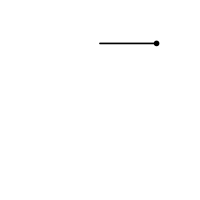
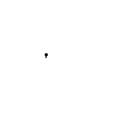
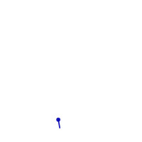

# Graft Syntax "v1"

This page describes the old "v1" syntax for Graft.  Most people will probably
want to use the new syntax, but for people who wrote programs for the old
version, or people who like writing programs that look like a cat walking
across a keyboard, it should still work fine, and we're not planning on getting
rid of it.

Most people should probably look at the [README](README.md), and learn the
newer syntax, which is a little easier to read, and more flexible.

## Examples

Circle:

```bash
./graft --syntax=v1 ':S+d'   # Step forward, then turn 10 degrees
```


Thick, rough, red circles saved to a GIF:

```bash
# Set red to 100, set brush size to 10,
# turn a random amount, then turn 10 degrees, then step forward
./graft --syntax=v1 '100=r10=z:R~+d+d:S' --frames=100 --gif=cir.gif --width=100 --height=75
```


Spinning box:

```bash
./graft --syntax=v1 '100=s:J90+d:S90+d:S90+d:S90+d15+d'
```



Flock of tiddlers:

```bash
./graft --syntax=v1 ':F:R~+d+d:S'
```



Explosion:

```bash
./graft --syntax=v1 '0=dd^11:F;f~=d30d;dd~+d10:S1+dd' --max-forks=100000 --frames=40
```


Windmill:

```bash
./graft --syntax=v1 --frames=20 '70=b90=a20=s-10=d10:{:S4+d}35:F10=s;f~=r;f~=g;f~=b20r45g75b;f~=d10d4:{:S+d}6:{20-a:S+d}^1=s+d:S'
```



There are more examples in the [animations](animations) directory.

## Commands

To turn, change the variable `d`:

* `+d` means turn 10 degrees clockwise.
* `45+d` means turn 45 degrees clockwise.
* `90-d` means turn 90 degrees anti-clockwise.
* `90=d` means set the angle to 90 degrees (face right).
* `-45=d` means set the angle to minus 45 degrees (face up-left).

To step forward (drawing a line), use the command `:S`:

* `:S` means step forward.  By default, this moves 10 units forward.

To change the step size, change the variable `s`:

* `20=s:S` means change step size to 20, and step forward.
* `2/s:S` means halve the step size (divide by 2), and step forward.

To change the width of the lines, change the variable `z`:

* `1.5z:S` means multiply width by 1.5 times, and step forward.

To do something several times, write a number, then the function to call,
either using a function name, or making a little function then and there:

* `2:S` means step twice.
* `36:{+d:S}` means turn then step 36 times.

By default, the whole of your program repeats over and over.  To repeat only
the last section (meaning the first section only runs once), add a label with
`^`:

* `1=s^+d1+s:S` means start with a step size of 1, and increase it (and the
  angle), then step, every time.  (Without the `^` the value of `s` would be
  reset back to 1 every time.)

## Special variables

Graft contains some variables with special meanings:

* `d` - "direction": the angle in degrees we are facing.
* `s` - "step size": how far the next `:S` call will move us.
* `z` - "size of brush": width of brush used for drawing lines.
* `r`, `g`, `b` - "red", "green", "blue": components of the colour of the
   brush (0-100).
* `a` - "alpha": transparency of the brush (0=transparent, 100=solid).
* `f` - "fork id": the number of the line we are currently controlling - this
  changes when we use `:F` to "fork" into multiple lines.

The colour and transparency values may be set to values outside the range.
Increasing or decreasing a value smoothly will result in gradual increase and
then decrease in the displayed value, because numbers over 100 wrap around to
-100, and negative values are displayed as their absolute value.

When graft starts, the following default values are set:

```graft
0=d
10=s
5=z
0=r
0=g
0=b
100=a
```

## Built-in functions

The following functions are pre-defined in graft:

* `S` - "Step": draw a line in direction `d` of length `s`.
* `D` - "Dot": draw a dot at x, y
* `L` - "Line to": draw a line from our old position to x, y
* `J` - "Jump": move `s` units in direction `d`, without drawing a line.
* `R` - "Random": return a random number between -10 and 10.
* `F` - "Fork": split into 2 lines, and continue running the same program
  in both.

## Language reference

### Numbers

Numbers are all held as floating point numbers.

They are written with an optional "-" followed by some digits, optionally
including a decimal point:

```
number ::= ["-"] digit* ["." digit*]
digit  ::= "0"..."9"
```

Note: when lines are actually drawn, all numbers are rounded to the nearest
0.1, but this does not affect variable values, just on-screen position.

### Symbols

Symbols are made up of lower and upper case ASCII characters:

```
symbol ::= (letter | "_")+
letter ::= "a"..."z" | "A"..."Z"
```

Note: by convention, symbols holding numbers are written in lower case, and
those holding functions are written in upper case.

### Changing variable values

To set a variable value, write the required value, then "=", then the variable
name:

```
assignment ::= input "=" symbol
input = number | functiondef | (symbol | functioncall) "~"
```

To modify a variable value by 10, write the "+" or "-" operator with no
argument before its name:

```
increase ::= "+" symbol
decrease ::= "-" symbol
```

To add, subtract, or divide by a number, write the number, then
the operation `+`, `-`, or `/` respectively, then the symbol.  Example:

* `3.1/d` - divide `d` by 3.1.

To multiply, write a number next to the symbol:

* `-4.5d` - multiply `d` by -4.5.

To provide a variable value, or the return value of a function, as the
input for an operator, write the variable name of call the function, then
suffix it with `~`.  Examples:

* `s~+d` - add the value of `s` to `d` (leaving `s` unchanged).
* `:R~/s` - divide `s` by the return value from the function `R`.

```
modify ::= multiply | input operator symbol
multiply ::= input symbol
operator ::= "+" | "-" | "/"
```

### Running functions

To run a function, write how many times to run it (optional), then `:` and
then its name:

```
functioncall ::= [number] ":" symbol
```

### Labels

To set the label (where in the program we will jump back to when we hit the
end), write "^":

```
label ::= "^"
```

### Combining statements

To run multiple statements, write them next to each other.  If an expression
would be ambiguous, or two symbols would run together, separate statements
with `;`:

```
program ::= statement+
statement ::= expression [";"]
expression ::= functioncall | modify | increase | decrease | assignment | label
```

### Defining functions

To describe a function, write "{", then the commands, then "}":

```
functiondef ::= "{" program "}"
```

### Forking

If you want to draw two lines simultaneously, use the `:F` command.

For example, to split into 2 lines and then make each of them move randomly,
run:

```bash
./graft --syntax=v1 ':F^:R~=d36d:S'
```

The above program means:

* `:F` - split into 2 lines
* `^` - set a label - when we reach the end we will restart here
* `:R~=d` - set `d` to a random number between -10 and 10
* `36d` - multiply `d` by 36
* `:S` - draw a line in the direction (`d`) we are facing

To split into more lines, put a number before `:F`.  For example:

```bash
./graft --syntax=v1 '3:F^:R~=d36d:S'
```

This program splits into 4 lines, and draws randomly as in the previous
example.

If you want to know which line is currently running, use the `f` variable.
The first line has `f` set to 0, and each time you fork the next line has
its version of `f` set to the next number: 1, 2 etc.

For example:

```bash
./graft --syntax=v1 '17:F;f~=d20d^+d:S'
```

The above program means:

* `17:F` - split into 18 lines
* `;` - this separates the previous statement from the next one
* `f~=d` - set `d` to the value of `f` - this is different for each line -
  0, 1, 2, etc.
* `20d` - multiply `d` by 20
* `:S` - draw a line in the direction (`d`) we are facing

Here's what it looks like:


